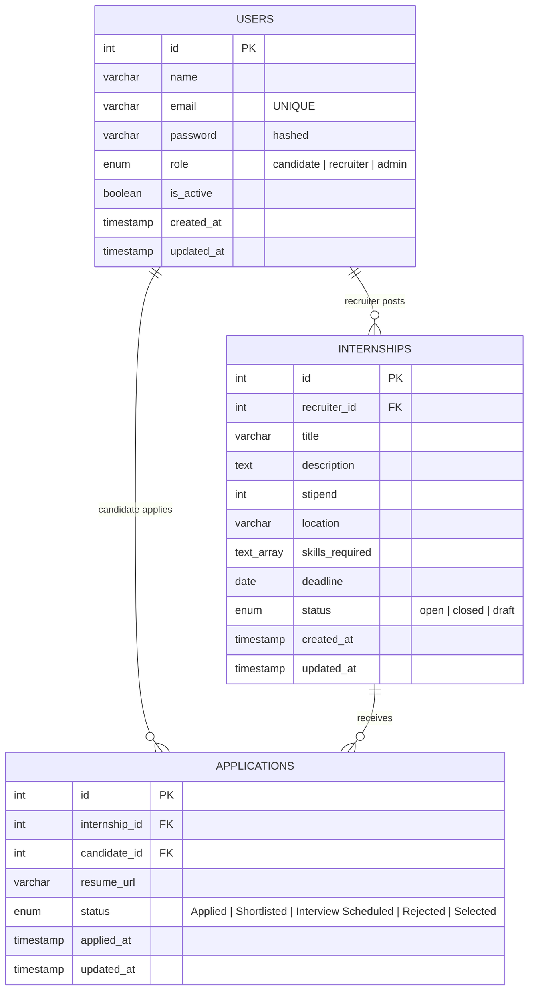

# ER Diagram — Internship & Recruitment Management System

## Entity-Relationship Diagram (Mermaid)

## Relationships

1. **USERS → INTERNSHIPS** (One-to-Many)
   - A user with role `recruiter` (or `admin`) can create many internships.
   - `internships.recruiter_id` references `users.id`.
   - On recruiter deletion, their internships are cascade-deleted.

2. **USERS → APPLICATIONS** (One-to-Many)
   - A user with role `candidate` can submit many applications.
   - `applications.candidate_id` references `users.id`.

3. **INTERNSHIPS → APPLICATIONS** (One-to-Many)
   - An internship can receive many applications.
   - `applications.internship_id` references `internships.id`.
   - A `UNIQUE(internship_id, candidate_id)` constraint prevents duplicate applications.

## Notes

- `skills_required` is stored as a PostgreSQL `text[]` array with a GIN index for fast filtering (`GET /internships?skills=nodejs,react`).
- `role`, `status` (internship), and `status` (application) are implemented as PostgreSQL `ENUM` types for data integrity.
- `created_at` / `updated_at` columns are auto-managed via triggers.
